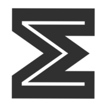

## SummIT 
 

Sum up the status from your monit instances

[][T]

| Node 8            | Latest Node            |
|-------------------|------------------------|
| [![Node 8][2]][T] | [![Latest Node][1]][T] |

[T]: https://travis-ci.org/ashishpandey/summit
[1]: https://travis-matrix-badges.herokuapp.com/repos/ashishpandey/summit/branches/master/1
[2]: https://travis-matrix-badges.herokuapp.com/repos/ashishpandey/summit/branches/master/2

This is not a replacement for M/monit which is a much advanced product with much more functionality. The goal here is to [KISS](https://en.wikipedia.org/wiki/KISS_principle), and just provide a overview of all of your monit instances at a glance

### Dev Usage

If you want to run in dev mode, follow the below steps
* clone this repo
* install nodejs (suggest using nvm, tested with node 8)
* install yarn (if using nvm, install without nodejs option)
* install nodemon globally (yarn global add nodemon)
* run yarn under checkout dir as well as under client dir
* create a config.yml in checkout directory (see [config.yml.sample](config.yml.sample) for inspiration)
* use yarn to (yarn `<command>`)
  * dev
  * build
  * test

Running "yarn dev" will start both client (UI) and server and proxy any API calls from client to the server
